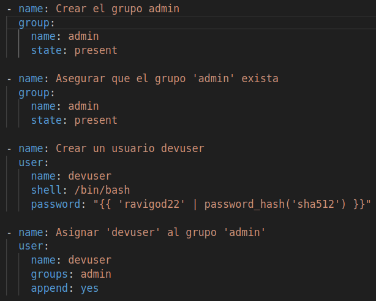

# Practica Calificada 5

## Informacion
**Alumno**: Jose Manuel Ravichagua Marin  
**Codigo**: 20210086C  
**Curso**: CC3S2 Desarrollo de Software  
**Profesor**: Cesar Lara

## Objetivo

Completar los ejercicios avanzados utilizando **Ansible**, **Vagrant** y **Docker**, siguiendo buenas prácticas de desarrollo y automatización. Deberás estructurar tu proyecto de manera organizada, utilizar control de versiones con **Git** y compartir tu trabajo a través de un repositorio en **GitHub**. Además, prepararás un archivo comprimido con todo el código y documentación necesaria.

## Estructura del proyecto

- proyecto/
    - ansible/
        - ejercicio1/
        - ejercicio2/
        - ...
        - ejercicio10/
    - handlers/
    - templates/
    - vagrant/
        - Vagrantfile
    - site.yml
    - README.md
    - docs/
        - Photos/

## Iniciar el proyecto
- PreRequisitos:
    - Instalar **VirtualBox**
    - Instalar **Ansible**
    - Instalar **Vagrant**
- Creamos un directorio proyecto, e inicializamos nuestro `Vagrantfile` con el siguiente comando:  
    - `vagrant init ubuntu/focal64`  
- Configuramos aquel **Vagranfile**, con una configuracion basica para levantar la maquina virtual.  

- Creacion de un archivo `site.yml`, donde realizaremos las tareas de una forma estructurada y con buenas practicas de codigo.

- Dado que se configuro para poder levantar nuestra maquina virtual, lo construimos con el siguiente comando:  
    - `vagrant up`

- Se mostrara las diversas tareas que se implemento para el proyecto, si ocurre algun error o quieres aumentar mas tareas sin levantar otra vez la maquina virtual, utiliza:  
    - `vagrant provision`

- Si deseas liberar recursos de la maquina virtual:
    - `vagrant destroy`

## Desarrollo de los ejercicios

### Ejercicio 1: Configuracion basica del sistema
- Se realizo la implementacion de un archivo **.gitignore** para excluir archivos temporales, claves privadas y archivos de maquina virtual generados.
 

- Implementacion de la primera tarea sobre:
    - Actualizar el sistema operativo.
    
    - Configurar locales y zonas horarias.
    
    - Configurar el entorno.
    
    - Crear usuarios y grupos con permisos especificos.
    

### Ejercicio 2: Implementacion de servicios web con seguridad basica

- Actualizamos el sistema, instalamos y configuramos **Nginx**.

- Generamos ceritificados SSL autofirmados para habilitar HTTPS.

- Configuracion basica de firewall para permitir el trafico de SSH, HTTP, HTTPS.

- Asimismo, implementacion de un manejador y una plantilla que configure Nginx para utilizar los certificados y servir en HTTPS.

### Ejercicio 3: Despliegue de aplicacion web con balanceador de carga

- Instalacion de Flask y Gunicorn  

- Creacion de directorios para la app de Flask

- Creacion de servicios systemd

- Habilitar servicios systemd

- Configurar para balanceo de carga

- Template de Flask, servicio systemd, balancerNginx
    - **Flask**
    
    - **Service**
    
    - **Balancer**
    

### Ejercicio 4: Monitore y alertas

- Instalar Prometheus

- Instalar Node Exporter

- Instalar dependencias para Grafana

- Configurar Prometheus

- Manejador de Reinicio Prometheus

- Templates Reinicio, nodeExporteService, PrometheusService
    - **PrometheusService**  
    
    - **Node Exporter**
    
    - **Alerta Prometheus**
    

### Resultado y Conclusiones:
- Avance de las tareas dadas por los ejercicios aun no concluidas pero con un avance del 25%.
- Se realizo las implementacion sin mostrar los resultados
- Resultado parcial de las tareas proporcionadas en el playbook **site.yml**
